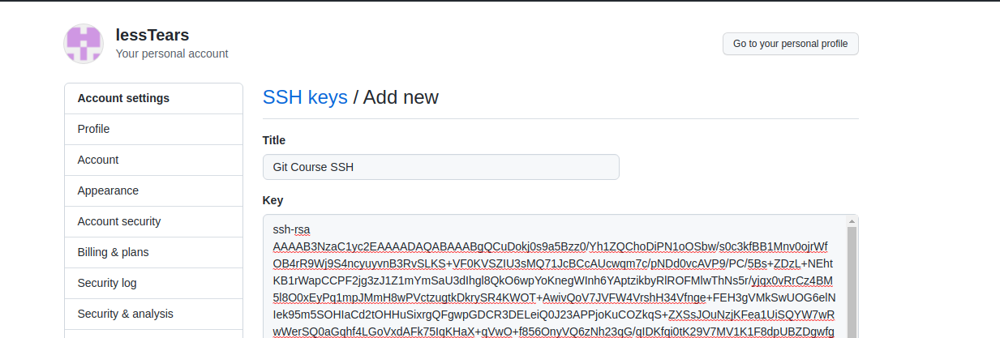

Git  教程

[toc]


# git 简介与安装

​	Git是什么？

​	Git是目前世界上最先进的分布式版本控制系统（没有之一）。

​	Git有什么特点？简单来说就是：高端大气上档次！

​	那什么是版本控制系统？

​	如果你用Microsoft Word写过长篇大论，那你一定有这样的经历：

​	想删除一个段落，又怕将来想恢复找不回来怎么办？有办法，先把当前文件“另存为……”一个新的Word文件，再接着改，改到一定程度，再“另存为……”一个新文件，这样一直改下去，最后你的Word文档变成了这样：


​	过了一周，你想找回被删除的文字，但是已经记不清删除前保存在哪个文件里了，只好一个一个文件去找，真麻烦。

​	看着一堆乱七八糟的文件，想保留最新的一个，然后把其他的删掉，又怕哪天会用上，还不敢删，真郁闷。

​	更要命的是，有些部分需要你的财务同事帮助填写，于是你把文件Copy 到U 盘里给她（也可能通过Email 发送一份给她），然后，你继续修改Word 文件。一天后，同事再把Word 文件传给你，此时，你必须想想，发给她之后到你收到她的文件期间，你作了哪些改动，得把你的改动和她的部分合并，真困难。

​	于是你想，如果有一个软件，不但能自动帮我记录每次文件的改动，还可以让同事协作编辑，这样就不用自己管理一堆类似的文件了，也不需要把文件传来传去。如果想查看某次改动，只需要在软件里瞄一眼就可以，岂不是很方便？

​	这个软件用起来就应该像这个样子，能记录每次文件的改动：

| 版本 | 文件名      | 用户 | 说明                   | 日期       |
| :--- | :---------- | :--- | :--------------------- | :--------- |
| 1    | service.doc | 张三 | 删除了软件服务条款5    | 7/12 10:38 |
| 2    | service.doc | 张三 | 增加了License人数限制  | 7/12 18:09 |
| 3    | service.doc | 李四 | 财务部门调整了合同金额 | 7/13 9:51  |
| 4    | service.doc | 张三 | 延长了免费升级周期     | 7/14 15:17 |


## Git 的诞生

​	很多人都知道，Linus 在1991 年创建了开源的Linux ，从此，Linux 系统不断发展，已经成为最大的服务器系统软件了。

​	Linus 虽然创建了Linux ，但Linux 的壮大是靠全世界热心的志愿者参与的，这么多人在世界各地为Linux 编写代码，那Linux 的代码是如何管理的呢？

​	事实是，在2002 年以前，世界各地的志愿者把源代码文件通过diff 的方式发给Linus ，然后由Linus 本人通过手工方式合并代码！

​	你也许会想，为什么Linus 不把Linux 代码放到版本控制系统里呢？不是有CVS 、SVN 这些免费的版本控制系统吗？因为Linus 坚定地反对CVS 和SVN ，这些集中式的版本控制系统不但速度慢，而且必须联网才能使用。有一些商用的版本控制系统，虽然比CVS 、SVN 好用，但那是付费的，和Linux 的开源精神不符。

​	不过，到了2002 年，Linux 系统已经发展了十年了，代码库之大让Linus 很难继续通过手工方式管理了，社区的弟兄们也对这种方式表达了强烈不满，于是Linus 选择了一个商业的版本控制系统BitKeeper ，BitKeeper 的东家BitMover 公司出于人道主义精神，授权Linux 社区免费使用这个版本控制系统。

​	安定团结的大好局面在2005 年就被打破了，原因是Linux 社区牛人聚集，不免沾染了一些梁山好汉的江湖习气。开发Samba 的Andrew 试图破解BitKeeper 的协议（这么干的其实也不只他一个），被BitMover 公司发现了（监控工作做得不错！），于是BitMover 公司怒了，要收回Linux 社区的免费使用权。

​	Linus 可以向BitMover 公司道个歉，保证以后严格管教弟兄们，嗯，这是不可能的。实际情况是这样的：

​	Linus 花了两周时间自己用C 写了一个分布式版本控制系统，这就是Git ！一个月之内，Linux 系统的源码已经由Git 管理了！牛是怎么定义的呢？大家可以体会一下。

​	Git 迅速成为最流行的分布式版本控制系统，尤其是2008 年，GitHub 网站上线了，它为开源项目免费提供Git 存储，无数开源项目开始迁移至GitHub ，包括jQuery ，PHP ，Ruby 等等。

​	历史就是这么偶然，如果不是当年BitMover 公司威胁Linux 社区，可能现在我们就没有免费而超级好用的Git 了。


## 集中式与分布式

​	Linus 一直痛恨的CVS 及SVN 都是集中式的版本控制系统，而Git 是分布式版本控制系统，集中式和分布式版本控制系统有什么区别呢？

​	先说集中式版本控制系统，版本库是集中存放在中央服务器的，而干活的时候，用的都是自己的电脑，所以要先从中央服务器取得最新的版本，然后开始干活，干完活了，再把自己的活推送给中央服务器。中央服务器就好比是一个图书馆，你要改一本书，必须先从图书馆借出来，然后回到家自己改，改完了，再放回图书馆。


​	集中式版本控制系统最大的毛病就是必须联网才能工作，如果在局域网内还好，带宽够大，速度够快，可如果在互联网上，遇到网速慢的话，可能提交一个10M 的文件就需要5 分钟，这还不得把人给憋死啊。

​	那分布式版本控制系统与集中式版本控制系统有何不同呢？首先，分布式版本控制系统根本没有“中央服务器”，每个人的电脑上都是一个完整的版本库，这样，你工作的时候，就不需要联网了，因为版本库就在你自己的电脑上。既然每个人电脑上都有一个完整的版本库，那多个人如何协作呢？比方说你在自己电脑上改了文件A，你的同事也在他的电脑上改了文件A ，这时，你们俩之间只需把各自的修改推送给对方，就可以互相看到对方的修改了。

​	和集中式版本控制系统相比，分布式版本控制系统的安全性要高很多，因为每个人电脑里都有完整的版本库，某一个人的电脑坏掉了不要紧，随便从其他人那里复制一个就可以了。而集中式版本控制系统的中央服务器要是出了问题，所有人都没法干活了。

​	在实际使用分布式版本控制系统的时候，其实很少在两人之间的电脑上推送版本库的修改，因为可能你们俩不在一个局域网内，两台电脑互相访问不了，也可能今天你的同事病了，他的电脑压根没有开机。因此，分布式版本控制系统通常也有一台充当“中央服务器”的电脑，但这个服务器的作用仅仅是用来方便“交换”大家的修改，没有它大家也一样干活，只是交换修改不方便而已。


​	当然，Git 的优势不单是不必联网这么简单，后面我们还会看到Gi t极其强大的分支管理，把SVN 等远远抛在了后面。

​	CVS 作为最早的开源而且免费的集中式版本控制系统，直到现在还有不少人在用。由于CVS 自身设计的问题，会造成提交文件不完整，版本库莫名其妙损坏的情况。同样是开源而且免费的SVN 修正了CVS 的一些稳定性问题，是目前用得最多的集中式版本库控制系统。

​	除了免费的外，还有收费的集中式版本控制系统，比如IBM 的ClearCase （以前是Rational 公司的，被IBM 收购了），特点是安装比Windows 还大，运行比蜗牛还慢，能用ClearCase 的一般是世界500 强，他们有个共同的特点是财大气粗，或者人傻钱多。

​	微软自己也有一个集中式版本控制系统叫VSS ，集成在Visual Studio 中。由于其反人类的设计，连微软自己都不好意思用了。

​	分布式版本控制系统除了Git 以及促使Git 诞生的BitKeeper 外，还有类似Git 的Mercurial 和Bazaar 等。这些分布式版本控制系统各有特点，但最快、最简单也最流行的依然是Git ！


## 安装Git


​	最早Git 是在Linux 上开发的，很长一段时间内，Git 也只能在Linux 和Unix 系统上跑。不过，慢慢地有人把它移植到了Windows 上。现在，Git 可以在Linux 、Unix 、Mac 和Windows 这几大平台上正常运行了。

​	要使用Git ，第一步当然是安装Git 了。

### 在Linux上安装Git

​	首先，你可以试着输入git，看看系统有没有安装Git

```
$ git
The program 'git' is currently not installed. You can install it by typing:
sudo apt-get install git
```


​	像上面的命令，有很多Linux 会友好地告诉你Git 没有安装，还会告诉你如何安装Git 。

​	如果你碰巧用Debian 或Ubuntu Linux ，通过一条`sudo apt-get install git` 就可以直接完成Git 的安装，非常简单。

​	老一点的Debian 或Ubuntu Linux ，要把命令改为`sudo apt-get install git-core`，因为以前有个软件也叫GIT（GNU Interactive Tools），结果Git 就只能叫git-core 了。由于Git 名气实在太大，后来就把GNU Interactive Tools 改成gnuit ，git-core 正式改为git 。

​	如果是其他Linux 版本，可以直接通过源码安装。先从Git 官网下载源码，然后解压，依次输入：

```
./config
make
sudo make install
```

这几个命令安装就好了。

### 在Mac OS X上安装Git

​	如果你正在使用Mac 做开发，有两种安装Git 的方法。

​	第一种是安装homebrew ，然后通过homebrew 安装Git ，具体方法请参考homebrew 的文档：http://brew.sh/。

​	第二种方法更简单，也是推荐的方法，就是直接从AppStore 安装Xcode ，Xcode 集成了Git ，不过默认没有安装，你需要运行Xcode ，选择菜单`Xcode/Preferences`，在弹出窗口中找到`Downloads`，选择`Command Line Tools` ，点`Install` 就可以完成安装了。

​	Xcode 是Apple 官方IDE ，功能非常强大，是开发Mac 和iOS App 的必选装备，而且是免费的！

### 在Windows上安装Git

​	在Windows 上使用Git ，可以从Git 官网直接[下载安装程序](https://git-scm.com/downloads)，然后按默认选项安装即可。

​	安装完成后，在开始菜单里找到`Git/Git Bash` ，蹦出一个类似命令行窗口的东西，就说明Git 安装成功！


### 安装成功之后

​	安装完成后，还需要最后一步设置，在命令行输入：

```
$ git config --global user.name "Your Name"
$ git config --global user.email "email@example.com"
```


​	因为Git 是分布式版本控制系统，所以，每个机器都必须自报家门：你的名字和Email 地址。你也许会担心，如果有人故意冒充别人怎么办？这个不必担心，首先我们相信大家都是善良无知的群众，其次，真的有冒充的也是有办法可查的。

​	注意`git config` 命令的`--global` 参数，用了这个参数，表示你这台机器上所有的Git 仓库都会使用这个配置，当然也可以对某个仓库指定不同的用户名和Email 地址。

​	通常会对不同的项目设置不同的用户名。

```
┌──(ajest💋zh-CN)-[~/Documents/docS/GIT Course]
└─$ git config user.name "AJEST"                                                           128 ⨯
                                                                                                 
┌──(ajest💋zh-CN)-[~/Documents/docS/GIT Course]
└─$ git config user.email "ajest@zh-cn.com"
                                                                                                 
┌──(ajest💋zh-CN)-[~/Documents/docS/GIT Course]
└─$ 
```


# 创建版本库

## 基本方法

​	什么是版本库呢？版本库又名仓库，英文名repository ，你可以简单理解成一个目录，这个目录里面的所有文件都可以被Git 管理起来，每个文件的修改、删除，Git 都能跟踪，以便任何时刻都可以追踪历史，或者在将来某个时刻可以“还原”。

​	所以，创建一个版本库非常简单，首先，选择一个合适的地方，创建一个空目录,或者一个已经存在的目录：

```
┌──(ajest💋zh-CN)-[~/Documents/docS/GIT Course]
└─$ pwd                  
/home/ajest/Documents/docS/GIT Course

┌──(ajest💋zh-CN)-[~/Documents/docS/GIT Course]
└─$ 
```

​	pwd 命令用于显示当前目录。

​	如果你使用Windows 系统，为了避免遇到各种莫名其妙的问题，请确保目录名（包括父目录）不包含中文。

​	第二步，通过`git init` 命令把这个目录变成Git 可以管理的仓库：

```
┌──(ajest💋zh-CN)-[~/Documents/docS/GIT Course]
└─$ git init    
提示：使用 'master' 作为初始分支的名称。这个默认分支名称可能会更改。要在新仓库中
提示：配置使用初始分支名，并消除这条警告，请执行：
提示：
提示：  git config --global init.defaultBranch <名称>
提示：
提示：除了 'master' 之外，通常选定的名字有 'main'、'trunk' 和 'development'。
提示：可以通过以下命令重命名刚创建的分支：
提示：
提示：  git branch -m <name>
已初始化空的 Git 仓库于 /mnt/data/documents/GIT Course/.git/
                                                                                    
┌──(ajest💋zh-CN)-[~/Documents/docS/GIT Course]
└─$ 
```

​	瞬间Git 就把仓库建好了，细心的读者可以发现当前目录下多了一个.git 的目录，这个目录是Git 来跟踪管理版本库的，没事千万不要手动修改这个目录里面的文件，不然改乱了，就把Git 仓库给破坏了。

​	如果你没有看到.git 目录，那是因为这个目录默认是隐藏的，用`ls -ah` 命令就可以看见。

```
┌──(ajest💋zh-CN)-[~/Documents/docS/GIT Course]
└─$ ls
'Git 教程.md'   img
                                                                   
┌──(ajest💋zh-CN)-[~/Documents/docS/GIT Course]
└─$ ls -alh  
总用量 28K
drwxr-xr-x 4 ajest ajest 4.0K Nov 15 10:59  .
drwxr-xr-x 3 ajest ajest 4.0K Nov 15 09:30  ..
drwxr-xr-x 7 ajest ajest 4.0K Nov 15 10:59  .git
-rw-r--r-- 1 ajest ajest  12K Nov 15 10:59 'Git 教程.md'
drwxr-xr-x 2 ajest ajest 4.0K Nov 15 10:59  img
                                                                                    
┌──(ajest💋zh-CN)-[~/Documents/docS/GIT Course]
└─$ 
```


## 把文件添加到版本库

​	首先这里再明确一下，所有的版本控制系统，其实只能跟踪文本文件的改动，比如TXT 文件，网页，所有的程序代码等等，Git 也不例外。版本控制系统可以告诉你每次的改动，比如在第5 行加了一个单词Linux ，在第8 行删了一个单词Windows  。而图片、视频这些二进制文件，虽然也能由版本控制系统管理，但没法跟踪文件的变化，只能把二进制文件每次改动串起来，也就是只知道图片从100KB 改成了120KB ，但到底改了啥，版本控制系统不知道，也没法知道。

​	不幸的是，Microsoft 的Word 格式是二进制格式，因此，版本控制系统是没法跟踪Word 文件的改动的，前面我们举的例子只是为了演示，如果要真正使用版本控制系统，就要以纯文本方式编写文件。

​	因为文本是有编码的，比如中文有常用的GBK 编码，日文有Shift_JIS 编码，如果没有历史遗留问题，强烈建议使用标准的UTF-8 编码，所有语言使用同一种编码，既没有冲突，又被所有平台所支持。

**使用Windows的童鞋要特别注意：**

​	千万不要使用Windows 自带的记事本编辑任何文本文件。原因是Microsoft 开发记事本的团队使用了一个非常弱智的行为来保存UTF-8 编码的文件，他们自作聪明地在每个文件开头添加了0xefbbbf（十六进制）的字符，你会遇到很多不可思议的问题，比如，网页第一行可能会显示一个“?”，明明正确的程序一编译就报语法错误，等等，都是由记事本的弱智行为带来的。建议你下载Visual Studio Code 代替记事本，不但功能强大，而且免费！

​	言归正传，现在我们编写一个readme.txt 文件，内容如下：

```
┌──(ajest💋zh-CN)-[~/Documents/docS/GIT Course]
└─$ vim readme.txt     
                                                                                                 
┌──(ajest💋zh-CN)-[~/Documents/docS/GIT Course]
└─$ cat readme.txt       
Git is a version control system.
Git is free software.
                                                                                                 
┌──(ajest💋zh-CN)-[~/Documents/docS/GIT Course]
└─$ 
```


​	一定要放到Git 仓库目录下（子目录也行），因为这是一个Git 仓库，放到其他地方Git 再厉害也找不到这个文件。

​	和把大象放到冰箱需要3步相比，把一个文件放到Git仓库只需要两步。

​	第一步，用命令git add告诉Git，把文件添加到仓库：

```
┌──(ajest💋zh-CN)-[~/Documents/docS/GIT Course]
└─$ git add readme.txt 
                                                                                                 
┌──(ajest💋zh-CN)-[~/Documents/docS/GIT Course]
└─$ 
```

​	执行上面的命令，没有任何显示，这就对了，Unix的哲学是“没有消息就是好消息”，说明添加成功。

​	第二步，用命令git commi t告诉Git ，把文件提交到仓库：

```
┌──(ajest💋zh-CN)-[~/Documents/docS/GIT Course]
└─$ git commit -m "wrote a readme file"    
[master（根提交） 2c0e948] wrote a readme file
 1 file changed, 2 insertions(+)
 create mode 100644 readme.txt
                                                                                                 
┌──(ajest💋zh-CN)-[~/Documents/docS/GIT Course]
└─$ 
```

​	简单解释一下`git commit` 命令，`-m` 后面输入的是本次提交的说明，可以输入任意内容，当然最好是有意义的，这样你就能从历史记录里方便地找到改动记录。

​	嫌麻烦不想输入`-m "xxx"` 行不行？确实有办法可以这么干，但是强烈不建议你这么干，因为输入说明对自己对别人阅读都很重要。实在不想输入说明的童鞋请自行Google ，我不告诉你这个参数。

​	`git commit` 命令执行成功后会告诉你：

```
1 file changed：1个文件被改动（我们新添加的readme.txt文件）
2 insertions：插入了两行内容（readme.txt有两行内容）。
```

​	为什么Git 添加文件需要`add `，`commit` 一共两步呢？因为`commit` 可以一次提交很多文件，所以你可以多次`add` 不同的文件，比如：

```
git add file1.txt
git add file2.txt file3.txt
git commit -m "add 3 files."
```


# 时光穿梭机

​	我们已经成功地添加并提交了一个readme.txt 文件，现在，是时候继续工作了，于是，我们继续修改readme.txt 文件，改成如下内容：

```
┌──(ajest💋zh-CN)-[~/Documents/docS/GIT Course]
└─$ cat readme.txt 
Git is a version control system.
Git is free software.
                                                                                                 
┌──(ajest💋zh-CN)-[~/Documents/docS/GIT Course]
└─$ vim readme.txt 
                                                                                                 
┌──(ajest💋zh-CN)-[~/Documents/docS/GIT Course]
└─$ cat readme.txt 
Git is a distributed version control system.
Git is free software.
                                                                                                 
┌──(ajest💋zh-CN)-[~/Documents/docS/GIT Course]
└─$ 
```

​	现在，运行`git status` 命令看看结果：

```
┌──(ajest💋zh-CN)-[~/Documents/docS/GIT Course]
└─$ git status                         
位于分支 master
尚未暂存以备提交的变更：
  （使用 "git add <文件>..." 更新要提交的内容）
  （使用 "git restore <文件>..." 丢弃工作区的改动）
        修改：     readme.txt

未跟踪的文件:
  （使用 "git add <文件>..." 以包含要提交的内容）
        "Git \346\225\231\347\250\213.md"
        img/

修改尚未加入提交（使用 "git add" 和/或 "git commit -a"）
                                                                                                 
┌──(ajest💋zh-CN)-[~/Documents/docS/GIT Course]
└─$ 

```
​	`git status` 命令可以让我们时刻掌握仓库当前的状态，上面的命令输出告诉我们，readme.txt 被修改过了，但还没有准备提交的修改。

​	虽然Git 告诉我们readme.txt 被修改了，但如果能看看具体修改了什么内容，自然是很好的。比如你休假两周从国外回来，第一天上班时，已经记不清上次怎么修改的readme.txt ，所以，需要用`git diff` 这个命令看看：

```
┌──(ajest💋zh-CN)-[~/Documents/docS/GIT Course]
└─$ git diff readme.txt 
diff --git a/readme.txt b/readme.txt
index 46d49bf..9247db6 100644
--- a/readme.txt
+++ b/readme.txt
@@ -1,2 +1,2 @@
-Git is a version control system.
+Git is a distributed version control system.
 Git is free software.
                                                                                                 
┌──(ajest💋zh-CN)-[~/Documents/docS/GIT Course]
└─$ 
```

​	`git diff` 顾名思义就是查看difference ，显示的格式正是Unix 通用的diff 格式，可以从上面的命令输出看到，我们在第一行添加了一个distributed 单词。

​	知道了对readme.txt 作了什么修改后，再把它提交到仓库就放心多了，提交修改和提交新文件是一样的两步，第一步是`git add` ：

```
┌──(ajest💋zh-CN)-[~/Documents/docS/GIT Course]
└─$ git add readme.txt                 
                                                                                                 
┌──(ajest💋zh-CN)-[~/Documents/docS/GIT Course]
└─$ 

```

​	同样没有任何输出。在执行第二步`git commit` 之前，我们再运行`git status` 看看当前仓库的状态：

```
┌──(ajest💋zh-CN)-[~/Documents/docS/GIT Course]
└─$ git status        
位于分支 master
要提交的变更：
  （使用 "git restore --staged <文件>..." 以取消暂存）
        修改：     readme.txt

未跟踪的文件:
  （使用 "git add <文件>..." 以包含要提交的内容）
        "Git \346\225\231\347\250\213.md"
        img/

                                                                                                 
┌──(ajest💋zh-CN)-[~/Documents/docS/GIT Course]
└─$ 

```

​	`git status` 告诉我们，将要被提交的修改包括`readme.txt` ，下一步，就可以放心地提交了：

```
┌──(ajest💋zh-CN)-[~/Documents/docS/GIT Course]
└─$ git commit -m "add distributed"    
[master 6f9e8ee] add distributed
 1 file changed, 1 insertion(+), 1 deletion(-)
                                                                                                 
┌──(ajest💋zh-CN)-[~/Documents/docS/GIT Course]
└─$ 
```

​	提交后，我们再用`git status` 命令看看仓库的当前状态：

```
┌──(ajest💋zh-CN)-[~/Documents/docS/GIT Course]
└─$ git status                     
位于分支 master
未跟踪的文件:
  （使用 "git add <文件>..." 以包含要提交的内容）
        "Git \346\225\231\347\250\213.md"
        img/

提交为空，但是存在尚未跟踪的文件（使用 "git add" 建立跟踪）
                                                                                                 
┌──(ajest💋zh-CN)-[~/Documents/docS/GIT Course]
└─$ 


```

​	Git 告诉我们当前没有需要提交的修改，而且，工作目录是干净（working tree clean）的。


## 版本回退

​	现在，你已经学会了修改文件，然后把修改提交到Git 版本库，现在，再练习一次，修改readme.txt 文件如下：

```
┌──(ajest💋zh-CN)-[~/Documents/docS/GIT Course]
└─$ vim readme.txt 
                                                                                                 
┌──(ajest💋zh-CN)-[~/Documents/docS/GIT Course]
└─$ cat readme.txt 
Git is a distributed version control system.
Git is free software distributed under the GPL.
                                                                                                 
┌──(ajest💋zh-CN)-[~/Documents/docS/GIT Course]
└─$ 

```

​	然后尝试提交：

```
┌──(ajest💋zh-CN)-[~/Documents/docS/GIT Course]
└─$ git add readme.txt 
                                                                                                 
┌──(ajest💋zh-CN)-[~/Documents/docS/GIT Course]
└─$ git commit -m "append GPL"     
[master 93bc440] append GPL
 1 file changed, 1 insertion(+), 1 deletion(-)
                                                                                                 
┌──(ajest💋zh-CN)-[~/Documents/docS/GIT Course]
└─$ 

```

​	像这样，你不断对文件进行修改，然后不断提交修改到版本库里，就好比玩RPG 游戏时，每通过一关就会自动把游戏状态存盘，如果某一关没过去，你还可以选择读取前一关的状态。有些时候，在打Boss 之前，你会手动存盘，以便万一打Boss 失败了，可以从最近的地方重新开始。Git 也是一样，每当你觉得文件修改到一定程度的时候，就可以“保存一个快照”，这个快照在Git 中被称为commit 。一旦你把文件改乱了，或者误删了文件，还可以从最近的一个commit 恢复，然后继续工作，而不是把几个月的工作成果全部丢失。

​	现在，我们回顾一下readme.txt 文件一共有几个版本被提交到Git仓库里了：

​	版本1：wrote a readme file

```
Git is a version control system.
Git is free software.
```

​	版本2：add distributed

```
Git is a distributed version control system.
Git is free software.
```

​	版本3：append GPL

```
Git is a distributed version control system.
Git is free software distributed under the GPL.
```

​	当然了，在实际工作中，我们脑子里怎么可能记得一个几千行的文件每次都改了什么内容，不然要版本控制系统干什么。版本控制系统肯定有某个命令可以告诉我们历史记录，在Git 中，我们用`git log` 命令查看：

```
┌──(ajest💋zh-CN)-[~/Documents/docS/GIT Course]
└─$ git log                   
commit 93bc440a34246ee691a9176e2378f65e40c683ee (HEAD -> master)
Author: AJEST <ajest@zh-cn.com>
Date:   Mon Nov 15 11:45:46 2021 +0800

    append GPL

commit 6f9e8ee2f50d715792af891c07eaf308c3d8bc0e
Author: AJEST <ajest@zh-cn.com>
Date:   Mon Nov 15 11:42:01 2021 +0800

    add distributed

commit 2c0e948d1f2dd6601b3954dbf4c2c9aa3a8ae2a2
Author: AJEST <ajest@zh-cn.com>
Date:   Mon Nov 15 11:28:45 2021 +0800

    wrote a readme file
                                                                                                 
┌──(ajest💋zh-CN)-[~/Documents/docS/GIT Course]
└─$ 
```

​	`git log` 命令显示从最近到最远的提交日志，我们可以看到3 次提交，最近的一次是append GPL ，上一次是add distributed ，最早的一次是wrote a readme file 。

​	如果嫌输出信息太多，看得眼花缭乱的，可以试试加上`--pretty=oneline` 参数：

```
┌──(ajest💋zh-CN)-[~/Documents/docS/GIT Course]
└─$ git log --pretty=oneline  
93bc440a34246ee691a9176e2378f65e40c683ee (HEAD -> master) append GPL
6f9e8ee2f50d715792af891c07eaf308c3d8bc0e add distributed
2c0e948d1f2dd6601b3954dbf4c2c9aa3a8ae2a2 wrote a readme file
                                                                                                 
┌──(ajest💋zh-CN)-[~/Documents/docS/GIT Course]
└─$ 
```

​	需要友情提示的是，你看到的一大串类似93bc440a34246ee691a9176e2378f65e40c683ee 的是`commit id`（版本号），和SVN 不一样，Git 的`commit id`不是1，2，3……递增的数字，而是一个SHA1 计算出来的一个非常大的数字，用十六进制表示，而且你看到的`commit id` 和我的肯定不一样，以你自己的为准。为什么`commit id` 需要用这么一大串数字表示呢？因为Git 是分布式的版本控制系统，后面我们还要研究多人在同一个版本库里工作，如果大家都用1，2，3…… 作为版本号，那肯定就冲突了。

​	每提交一个新版本，实际上Git 就会把它们自动串成一条时间线。如果使用可视化工具查看Git 历史，就可以更清楚地看到提交历史的时间线。

​	好了，现在我们启动时光穿梭机，准备把`readme.txt` 回退到上一个版本，也就是`add distributed` 的那个版本，怎么做呢？

​	首先，Git 必须知道当前版本是哪个版本，在Git 中，用`HEAD `表示当前版本，也就是最新的提交93bc440a34246ee691a9176e2378f65e40c683ee（注意我的提交ID和你的肯定不一样），上一个版本就是`HEAD^`，上上一个版本就是`HEAD^^`，当然往上100个版本写100个`^`比较容易数不过来，所以写成`HEAD~100`。

​	现在，我们要把当前版本`append GPL`回退到上一个版本`add distributed` ，就可以使用`git reset` 命令：

```
┌──(ajest💋zh-CN)-[~/Documents/docS/GIT Course]
└─$ git reset --hard HEAD^  
HEAD 现在位于 6f9e8ee add distributed
                                                                                                 
┌──(ajest💋zh-CN)-[~/Documents/docS/GIT Course]
└─$ 
```

​	`--hard` 参数有啥意义？这个后面再讲，现在你先放心使用。

​	看看`readme.txt`的内容是不是版本`add distributed`：

```
┌──(ajest💋zh-CN)-[~/Documents/docS/GIT Course]
└─$ cat readme.txt 
Git is a distributed version control system.
Git is free software.
                                                                                                 
┌──(ajest💋zh-CN)-[~/Documents/docS/GIT Course]
└─$ 
```

​	果然被还原了。

​	还可以继续回退到上一个版本`wrote a readme file` ，不过且慢，让我们用`git log` 再看看现在版本库的状态：

```
┌──(ajest💋zh-CN)-[~/Documents/docS/GIT Course]
└─$ git log                 
commit 6f9e8ee2f50d715792af891c07eaf308c3d8bc0e (HEAD -> master)
Author: AJEST <ajest@zh-cn.com>
Date:   Mon Nov 15 11:42:01 2021 +0800

    add distributed

commit 2c0e948d1f2dd6601b3954dbf4c2c9aa3a8ae2a2
Author: AJEST <ajest@zh-cn.com>
Date:   Mon Nov 15 11:28:45 2021 +0800

    wrote a readme file
                                                                                                 
┌──(ajest💋zh-CN)-[~/Documents/docS/GIT Course]
└─$ 
```

​	最新的那个版本`append GPL`已经看不到了！好比你从21 世纪坐时光穿梭机来到了19 世纪，想再回去已经回不去了，肿么办？

​	办法其实还是有的，只要上面的命令行窗口还没有被关掉，你就可以顺着往上找啊找啊，找到那个`append GPL`的`commit id`是`93bc440a34246ee691a9176e2378f65e40c683ee` ，于是就可以指定回到未来的某个版本：

```
┌──(ajest💋zh-CN)-[~/Documents/docS/GIT Course]
└─$ git reset --hard 93bc440a34246ee691a9176e2378f65e40c683ee
HEAD 现在位于 93bc440 append GPL
                                                                                                 
┌──(ajest💋zh-CN)-[~/Documents/docS/GIT Course]
└─$ 
```

​	版本号没必要写全，前几位就可以了，Git 会自动去找。当然也不能只写前一两位，因为Git 可能会找到多个版本号，就无法确定是哪一个了。

​	再小心翼翼地看看`readme.txt`的内容：

```
┌──(ajest💋zh-CN)-[~/Documents/docS/GIT Course]
└─$ cat readme.txt 
Git is a distributed version control system.
Git is free software distributed under the GPL.
                                                                                                 
┌──(ajest💋zh-CN)-[~/Documents/docS/GIT Course]
└─$ 
```

​	果然，我胡汉三又回来了。

​	Git 的版本回退速度非常快，因为Git 在内部有个指向当前版本的`HEAD ` 指针，当你回退版本的时候，Git 仅仅是把HEAD 从指向`append GPL`：

```ascii
+------+
| HEAD |
+------+
   |
   +--->+ append GPL
   		|
        + add distributed
        |
        + wrote a readme file
```

改为指向`add distributed`：

```ascii
+------+
| HEAD |
+------+
   |
   |    + append GPL
   |    |
   +--->+ add distributed
        |
        + wrote a readme file
```

​	然后顺便把工作区的文件更新了。所以你让`HEAD` 指向哪个版本号，你就把当前版本定位在哪。

​	现在，你回退到了某个版本，关掉了电脑，第二天早上就后悔了，想恢复到新版本怎么办？找不到新版本的`commit id` 怎么办？

​	在Git 中，总是有后悔药可以吃的。当你用`git reset --hard HEAD^` 回退到`add distributed` 版本时，再想恢复到`append GPL` ，就必须找到`append GPL` 的commit id 。Git 提供了一个命令`git reflog` 用来记录你的每一次命令：

```
┌──(ajest💋zh-CN)-[~/Documents/docS/GIT Course]
└─$ git reflog                                               
93bc440 (HEAD -> master) HEAD@{0}: reset: moving to 93bc440a34246ee691a9176e2378f65e40c683ee
6f9e8ee HEAD@{1}: reset: moving to HEAD^
93bc440 (HEAD -> master) HEAD@{2}: commit: append GPL
6f9e8ee HEAD@{3}: commit: add distributed
2c0e948 HEAD@{4}: commit (initial): wrote a readme file
                                                                                                 
┌──(ajest💋zh-CN)-[~/Documents/docS/GIT Course]
└─$ 
```

​	终于舒了口气，从输出可知，`append GPL` 的commit id是`93bc440` ，现在，你又可以乘坐时光机回到未来了。


## 工作区和暂存区


​	Git 和其他版本控制系统如SVN 的一个不同之处就是有暂存区的概念。

### 工作区

（Working Directory）

​	就是你在电脑里能看到的目录，比如我的`learngit` 文件夹就是一个工作区：

```
┌──(ajest💋zh-CN)-[~/Documents/docS/GIT Course]
└─$ ls                         
'Git 教程.md'   img   readme.txt
                                                                                                 
┌──(ajest💋zh-CN)-[~/Documents/docS/GIT Course]
└─$ 
```


### 版本库

​	（Repository）

​	工作区有一个隐藏目录`.git`，这个不算工作区，而是Git的版本库。

​	Git 的版本库里存了很多东西，其中最重要的就是称为stage（或者叫index）的暂存区，还有Git为我们自动创建的第一个分支`master`，以及指向`master`的一个指针叫`HEAD`。


​	分支和`HEAD`的概念我们以后再讲。

​	前面讲了我们把文件往Git 版本库里添加的时候，是分两步执行的：

​	第一步是用`git add`把文件添加进去，实际上就是把文件修改添加到暂存区；

​	第二步是用`git commit`提交更改，实际上就是把暂存区的所有内容提交到当前分支。

​	因为我们创建Git 版本库时，Git自动为我们创建了唯一一个`master`分支，所以，现在，`git commit`就是往`master`分支上提交更改。

​	你可以简单理解为，需要提交的文件修改通通放到暂存区，然后，一次性提交暂存区的所有修改。

​	俗话说，实践出真知。现在，我们再练习一遍，先对`readme.txt`做个修改，比如加上一行内容：

```
┌──(ajest💋zh-CN)-[~/Documents/docS/GIT Course]
└─$ cat readme.txt 
Git is a distributed version control system.
Git is free software distributed under the GPL.
Git has a mutable index called stage.
                                                                                                 
┌──(ajest💋zh-CN)-[~/Documents/docS/GIT Course]
└─$ 
```

​	然后，在工作区新增一个`LICENSE`文本文件（内容随便写）。

```
┌──(ajest💋zh-CN)-[~/Documents/docS/GIT Course]
└─$ vim LICENSE   
                                                                                                 
┌──(ajest💋zh-CN)-[~/Documents/docS/GIT Course]
└─$ cat LICENSE   
edit by AJEST.

┌──(ajest💋zh-CN)-[~/Documents/docS/GIT Course]
└─$ 
```


​	先用`git status`查看一下状态：

```
┌──(ajest💋zh-CN)-[~/Documents/docS/GIT Course]
└─$ git status 
位于分支 master
尚未暂存以备提交的变更：
  （使用 "git add <文件>..." 更新要提交的内容）
  （使用 "git restore <文件>..." 丢弃工作区的改动）
        修改：     readme.txt

未跟踪的文件:
  （使用 "git add <文件>..." 以包含要提交的内容）
        "Git \346\225\231\347\250\213.md"
        LICENSE
        img/

修改尚未加入提交（使用 "git add" 和/或 "git commit -a"）
                                                                                                 
┌──(ajest💋zh-CN)-[~/Documents/docS/GIT Course]
└─$ 

```

​	Git 非常清楚地告诉我们，`readme.txt`被修改了，而`LICENSE` 还从来没有被添加过，所以它的状态是`Untracked`。

​	现在，使用两次命令`git add`，把`readme.txt`和`LICENSE`都添加后，用`git status`再查看一下：

```
┌──(ajest💋zh-CN)-[~/Documents/docS/GIT Course]
└─$ git add readme.txt 
                                                                                                 
┌──(ajest💋zh-CN)-[~/Documents/docS/GIT Course]
└─$ git add LICENSE   
                                                                                                 
┌──(ajest💋zh-CN)-[~/Documents/docS/GIT Course]
└─$ git status     
位于分支 master
要提交的变更：
  （使用 "git restore --staged <文件>..." 以取消暂存）
        新文件：   LICENSE
        修改：     readme.txt

未跟踪的文件:
  （使用 "git add <文件>..." 以包含要提交的内容）
        "Git \346\225\231\347\250\213.md"
        img/

                                                                                                 
┌──(ajest💋zh-CN)-[~/Documents/docS/GIT Course]
└─$ 
```

​	现在，暂存区的状态就变成这样了：


​	所以，`git add`命令实际上就是把要提交的所有修改放到暂存区（Stage），然后，执行`git commit`就可以一次性把暂存区的所有修改提交到分支。

```
┌──(ajest💋zh-CN)-[~/Documents/docS/GIT Course]
└─$ git commit -m "understand how stage works" 
[master 8a80146] understand how stage works
 2 files changed, 2 insertions(+)
 create mode 100644 LICENSE
                                                                                                 
┌──(ajest💋zh-CN)-[~/Documents/docS/GIT Course]
└─$ 

```

​	一旦提交后，如果你又没有对工作区做任何修改，那么工作区就是“干净”的：

```
┌──(ajest💋zh-CN)-[~/Documents/docS/GIT Course]
└─$ git status                                
位于分支 master
未跟踪的文件:
  （使用 "git add <文件>..." 以包含要提交的内容）
        "Git \346\225\231\347\250\213.md"
        img/

提交为空，但是存在尚未跟踪的文件（使用 "git add" 建立跟踪）
                                                                                                 
┌──(ajest💋zh-CN)-[~/Documents/docS/GIT Course]
└─$ 
```

现在版本库变成了这样，暂存区就没有任何内容了：


## 管理修改

​	现在，假定你已经完全掌握了暂存区的概念。下面，我们要讨论的就是，为什么Git 比其他版本控制系统设计得优秀，因为Git 跟踪并管理的是修改，而非文件。

​	你会问，什么是修改？比如你新增了一行，这就是一个修改，删除了一行，也是一个修改，更改了某些字符，也是一个修改，删了一些又加了一些，也是一个修改，甚至创建一个新文件，也算一个修改。

​	为什么说Git 管理的是修改，而不是文件呢？我们还是做实验。第一步，对readme.txt 做一个修改，比如加一行内容：

```
┌──(ajest💋zh-CN)-[~/Documents/docS/GIT Course]
└─$ vim readme.txt 
                                                                                                 
┌──(ajest💋zh-CN)-[~/Documents/docS/GIT Course]
└─$ cat readme.txt 
Git is a distributed version control system.
Git is free software distributed under the GPL.
Git has a mutable index called stage.
Git tracks changes.
                                                                                                 
┌──(ajest💋zh-CN)-[~/Documents/docS/GIT Course]
└─$ 
```

​	然后，添加：

```
┌──(ajest💋zh-CN)-[~/Documents/docS/GIT Course]
└─$ git add readme.txt 
                                                                                                 
┌──(ajest💋zh-CN)-[~/Documents/docS/GIT Course]
└─$ git status        
位于分支 master
要提交的变更：
  （使用 "git restore --staged <文件>..." 以取消暂存）
        修改：     readme.txt

未跟踪的文件:
  （使用 "git add <文件>..." 以包含要提交的内容）
        "Git \346\225\231\347\250\213.md"
        img/

                                                                                                 
┌──(ajest💋zh-CN)-[~/Documents/docS/GIT Course]
└─$ 
```

​	然后，再修改readme.txt：

```
┌──(ajest💋zh-CN)-[~/Documents/docS/GIT Course]
└─$ vim readme.txt 
                                                                                                 
┌──(ajest💋zh-CN)-[~/Documents/docS/GIT Course]
└─$ cat readme.txt 
Git is a distributed version control system.
Git is free software distributed under the GPL.
Git has a mutable index called stage.
Git tracks changes of files.
                                                                                                 
┌──(ajest💋zh-CN)-[~/Documents/docS/GIT Course]
└─$ 
```

​	提交：

```
┌──(ajest💋zh-CN)-[~/Documents/docS/GIT Course]
└─$ git commit -m "git tracks changes"        
[master 88d46f5] git tracks changes
 1 file changed, 1 insertion(+)
                                                                                                 
┌──(ajest💋zh-CN)-[~/Documents/docS/GIT Course]
└─$    
```

提交后，再看看状态：

```
┌──(ajest💋zh-CN)-[~/Documents/docS/GIT Course]
└─$ git status                        
位于分支 master
尚未暂存以备提交的变更：
  （使用 "git add <文件>..." 更新要提交的内容）
  （使用 "git restore <文件>..." 丢弃工作区的改动）
        修改：     readme.txt

未跟踪的文件:
  （使用 "git add <文件>..." 以包含要提交的内容）
        "Git \346\225\231\347\250\213.md"
        img/

修改尚未加入提交（使用 "git add" 和/或 "git commit -a"）
                                                                                                 
┌──(ajest💋zh-CN)-[~/Documents/docS/GIT Course]
└─$ 
```

​	咦，怎么第二次的修改没有被提交？

​	别激动，我们回顾一下操作过程：

​	第一次修改 -> `git add` -> 第二次修改 -> `git commit`

​	你看，我们前面讲了，Git 管理的是修改，当你用`git add` 命令后，在工作区的第一次修改被放入暂存区，准备提交，但是，在工作区的第二次修改并没有放入暂存区，所以，`git commit`只负责把暂存区的修改提交了，也就是第一次的修改被提交了，第二次的修改不会被提交。

​	提交后，用`git diff HEAD -- readme.txt`命令可以查看工作区和版本库里面最新版本的区别：

```
┌──(ajest💋zh-CN)-[~/Documents/docS/GIT Course]
└─$ git diff HEAD -- readme.txt 
diff --git a/readme.txt b/readme.txt
index 76d770f..a9c5755 100644
--- a/readme.txt
+++ b/readme.txt
@@ -1,4 +1,4 @@
 Git is a distributed version control system.
 Git is free software distributed under the GPL.
 Git has a mutable index called stage.
-Git tracks changes.
+Git tracks changes of files.
                                                                                                 
┌──(ajest💋zh-CN)-[~/Documents/docS/GIT Course]
└─$ 
```

​	可见，第二次修改确实没有被提交。

​	那怎么提交第二次修改呢？你可以继续`git add`再`git commit`，也可以别着急提交第一次修改，先`git add`第二次修改，再`git commit`，就相当于把两次修改合并后一块提交了：

​	第一次修改 -> `git add` -> 第二次修改 -> `git add` -> `git commit`

​	好，现在，把第二次修改提交了。

```
┌──(ajest💋zh-CN)-[~/Documents/docS/GIT Course]
└─$ git add readme.txt                  
                                                                                                 
┌──(ajest💋zh-CN)-[~/Documents/docS/GIT Course]
└─$ git commit -m "git tracks changes of files."
[master 6cd4d60] git tracks changes of files.
 1 file changed, 1 insertion(+), 1 deletion(-)
                                                                                                 
┌──(ajest💋zh-CN)-[~/Documents/docS/GIT Course]
└─$ git status                                  
位于分支 master
未跟踪的文件:
  （使用 "git add <文件>..." 以包含要提交的内容）
        "Git \346\225\231\347\250\213.md"
        img/

提交为空，但是存在尚未跟踪的文件（使用 "git add" 建立跟踪）
                                                                                                 
┌──(ajest💋zh-CN)-[~/Documents/docS/GIT Course]
└─$ 
```


## 撤销修改

​	自然，你是不会犯错的。不过现在是凌晨两点，你正在赶一份工作报告，你在`readme.txt` 中添加了一行：

```
┌──(ajest💋zh-CN)-[~/Documents/docS/GIT Course]
└─$ cat readme.txt 
Git is a distributed version control system.
Git is free software distributed under the GPL.
Git has a mutable index called stage.
Git tracks changes of files.
My stupid boss still prefers SVN.
                                                                                                 
┌──(ajest💋zh-CN)-[~/Documents/docS/GIT Course]
└─$ 
```

​	在你准备提交前，一杯咖啡起了作用，你猛然发现了`stupid boss`可能会让你丢掉这个月的奖金！

​	既然错误发现得很及时，就可以很容易地纠正它。你可以删掉最后一行，手动把文件恢复到上一个版本的状态。如果用`git status`查看一下：

```
┌──(ajest💋zh-CN)-[~/Documents/docS/GIT Course]
└─$ git status   
位于分支 master
尚未暂存以备提交的变更：
  （使用 "git add <文件>..." 更新要提交的内容）
  （使用 "git restore <文件>..." 丢弃工作区的改动）
        修改：     readme.txt

未跟踪的文件:
  （使用 "git add <文件>..." 以包含要提交的内容）
        "Git \346\225\231\347\250\213.md"
        img/

修改尚未加入提交（使用 "git add" 和/或 "git commit -a"）
                                                                                                 
┌──(ajest💋zh-CN)-[~/Documents/docS/GIT Course]
└─$ 
```

​	你可以发现，Git 会告诉你，`git restore -- file` 可以丢弃工作区的修改：

```
$ git restore -- readme.txt
```

​	命令`git restore -- readme.txt`意思就是，把`readme.txt`文件在工作区的修改全部撤销，这里有两种情况：

​	一种是`readme.txt`自修改后还没有被放到暂存区，现在，撤销修改就回到和版本库一模一样的状态；

​	一种是`readme.txt`已经添加到暂存区后，又作了修改，现在，撤销修改就回到添加到暂存区后的状态。

​	总之，就是让这个文件回到最近一次`git commit`或`git add`时的状态。

​	现在，看看`readme.txt`的文件内容：

```
┌──(ajest💋zh-CN)-[~/Documents/docS/GIT Course]
└─$ cat readme.txt 
Git is a distributed version control system.
Git is free software distributed under the GPL.
Git has a mutable index called stage.
Git tracks changes of files.
                                                                                                 
┌──(ajest💋zh-CN)-[~/Documents/docS/GIT Course]
└─$ 
```

​	文件内容果然复原了。

​	`git restore -- file`命令中的`--`很重要，没有`--`，就变成了“切换到另一个分支”的命令，我们在后面的分支管理中会再次遇到`git restore`命令。

​	现在假定是凌晨3点，你不但写了一些胡话，还`git add`到暂存区了：

```
┌──(ajest💋zh-CN)-[~/Documents/docS/GIT Course]
└─$ vim readme.txt 
                                                                                                 
┌──(ajest💋zh-CN)-[~/Documents/docS/GIT Course]
└─$ cat readme.txt            
Git is a distributed version control system.
Git is free software distributed under the GPL.
Git has a mutable index called stage.
Git tracks changes of files.
My stupid boss still prefers SVN.
                                                                                                 
┌──(ajest💋zh-CN)-[~/Documents/docS/GIT Course]
└─$ git add readme.txt        
                                                                                                 
┌──(ajest💋zh-CN)-[~/Documents/docS/GIT Course]
└─$ 
```

​	庆幸的是，在`commit`之前，你发现了这个问题。用`git status`查看一下，修改只是添加到了暂存区，还没有提交：

```
┌──(ajest💋zh-CN)-[~/Documents/docS/GIT Course]
└─$ git status        
位于分支 master
要提交的变更：
  （使用 "git restore --staged <文件>..." 以取消暂存）
        修改：     readme.txt

未跟踪的文件:
  （使用 "git add <文件>..." 以包含要提交的内容）
        "Git \346\225\231\347\250\213.md"
        img/

                                                                                                 
┌──(ajest💋zh-CN)-[~/Documents/docS/GIT Course]
└─$ 
```

​	Git 同样告诉我们，用命令`git restore --staged <文件>`可以把暂存区的修改撤销掉（unstage），重新放回工作区：

```
┌──(ajest💋zh-CN)-[~/Documents/docS/GIT Course]
└─$ git restore --staged readme.txt                          
                                                                                                 
┌──(ajest💋zh-CN)-[~/Documents/docS/GIT Course]
└─$
```

​	`git reset`命令既可以回退版本，也可以把暂存区的修改回退到工作区。当我们用`HEAD`时，表示最新的版本。

再用`git status`查看一下，现在暂存区是干净的，工作区有修改：

```
┌──(ajest💋zh-CN)-[~/Documents/docS/GIT Course]
└─$ git status                     
位于分支 master
尚未暂存以备提交的变更：
  （使用 "git add <文件>..." 更新要提交的内容）
  （使用 "git restore <文件>..." 丢弃工作区的改动）
        修改：     readme.txt

未跟踪的文件:
  （使用 "git add <文件>..." 以包含要提交的内容）
        "Git \346\225\231\347\250\213.md"
        img/

修改尚未加入提交（使用 "git add" 和/或 "git commit -a"）
                                                                                                 
┌──(ajest💋zh-CN)-[~/Documents/docS/GIT Course]
└─$ 
```

还记得如何丢弃工作区的修改吗？

```
┌──(ajest💋zh-CN)-[~/Documents/docS/GIT Course]
└─$ git restore -- readme.txt      
                                                                                                 
┌──(ajest💋zh-CN)-[~/Documents/docS/GIT Course]
└─$ cat readme.txt 
Git is a distributed version control system.
Git is free software distributed under the GPL.
Git has a mutable index called stage.
Git tracks changes of files.
                                                                                                 
┌──(ajest💋zh-CN)-[~/Documents/docS/GIT Course]
└─$ 

```

​	整个世界终于清静了！

​	现在，假设你不但改错了东西，还从暂存区提交到了版本库，怎么办呢？还记得版本回退一节吗？可以回退到上一个版本。不过，这是有条件的，就是你还没有把自己的本地版本库推送到远程。还记得Git 是分布式版本控制系统吗？我们后面会讲到远程版本库，一旦你把`stupid boss`提交推送到远程版本库，你就真的惨了……


## 删除文件

​	在Gi t中，删除也是一个修改操作，我们实战一下，先添加一个新文件`test.txt` 到Git并且提交：

```
┌──(ajest💋zh-CN)-[~/Documents/docS/GIT Course]
└─$ touch test.txt           
                                                                                                 
┌──(ajest💋zh-CN)-[~/Documents/docS/GIT Course]
└─$ vim test.txt  
                                                                                                 
┌──(ajest💋zh-CN)-[~/Documents/docS/GIT Course]
└─$ cat test.txt                            
This is a del file testing.
                                                                                                 
┌──(ajest💋zh-CN)-[~/Documents/docS/GIT Course]
└─$ git status               
位于分支 master
未跟踪的文件:
  （使用 "git add <文件>..." 以包含要提交的内容）
        "Git \346\225\231\347\250\213.md"
        img/
        test.txt

提交为空，但是存在尚未跟踪的文件（使用 "git add" 建立跟踪）
                                                                                                 
┌──(ajest💋zh-CN)-[~/Documents/docS/GIT Course]
└─$ git add test.txt  
                                                                                                 
┌──(ajest💋zh-CN)-[~/Documents/docS/GIT Course]
└─$ git status      
位于分支 master
要提交的变更：
  （使用 "git restore --staged <文件>..." 以取消暂存）
        新文件：   test.txt

未跟踪的文件:
  （使用 "git add <文件>..." 以包含要提交的内容）
        "Git \346\225\231\347\250\213.md"
        img/

                                                                                                 
┌──(ajest💋zh-CN)-[~/Documents/docS/GIT Course]
└─$ git commit -m "add test.txt file."          
[master 274c2a1] add test.txt file.
 1 file changed, 1 insertion(+)
 create mode 100644 test.txt
                                                                                                 
┌──(ajest💋zh-CN)-[~/Documents/docS/GIT Course]
└─$ git status                                                                             127 ⨯
位于分支 master
未跟踪的文件:
  （使用 "git add <文件>..." 以包含要提交的内容）
        "Git \346\225\231\347\250\213.md"
        img/

提交为空，但是存在尚未跟踪的文件（使用 "git add" 建立跟踪）
                                                                                                 
┌──(ajest💋zh-CN)-[~/Documents/docS/GIT Course]
└─$ 
```

​	一般情况下，你通常直接在文件管理器中把没用的文件删了，或者用`rm`命令删了：

```
┌──(ajest💋zh-CN)-[~/Documents/docS/GIT Course]
└─$ rm test.txt                                    
                                                                                                 
┌──(ajest💋zh-CN)-[~/Documents/docS/GIT Course]
└─$ 
```

​	这个时候，Git知道你删除了文件，因此，工作区和版本库就不一致了，`git status`命令会立刻告诉你哪些文件被删除了：

```
┌──(ajest💋zh-CN)-[~/Documents/docS/GIT Course]
└─$ git status
位于分支 master
尚未暂存以备提交的变更：
  （使用 "git add/rm <文件>..." 更新要提交的内容）
  （使用 "git restore <文件>..." 丢弃工作区的改动）
        删除：     test.txt

未跟踪的文件:
  （使用 "git add <文件>..." 以包含要提交的内容）
        "Git \346\225\231\347\250\213.md"
        img/

修改尚未加入提交（使用 "git add" 和/或 "git commit -a"）
                                                                                                 
┌──(ajest💋zh-CN)-[~/Documents/docS/GIT Course]
└─$ 
```

​	现在你有两个选择，一是确实要从版本库中删除该文件，那就用命令`git rm`删掉，并且`git commit`：

```
┌──(ajest💋zh-CN)-[~/Documents/docS/GIT Course]
└─$ git rm test.txt          
rm 'test.txt'
                                                                                                 
┌──(ajest💋zh-CN)-[~/Documents/docS/GIT Course]
└─$ git commit -m "remove test.txt"
[master 796bf5f] remove test.txt
 1 file changed, 1 deletion(-)
 delete mode 100644 test.txt
                                                                                                 
┌──(ajest💋zh-CN)-[~/Documents/docS/GIT Course]
└─$ 

```

​	现在，文件就从版本库中被删除了。

 	小提示：先手动删除文件，然后使用git rm <file>和git add<file>效果是一样的。

​	另一种情况是删错了，因为版本库里还有呢，所以可以很轻松地把误删的文件恢复到最新版本：

```
┌──(ajest💋zh-CN)-[~/Documents/docS/GIT Course]
└─$ git restore readme.txt
                                                                                                 
┌──(ajest💋zh-CN)-[~/Documents/docS/GIT Course]
└─$ 
```

`git restore `其实是用版本库里的版本替换工作区的版本，无论工作区是修改还是删除，都可以“一键还原”。

 **注意：从来没有被添加到版本库就被删除的文件，是无法恢复的！**

# 远程仓库

​	到目前为止，我们已经掌握了如何在Git 仓库里对一个文件进行时光穿梭，你再也不用担心文件备份或者丢失的问题了。

​	可是有用过集中式版本控制系统SVN 的童鞋会站出来说，这些功能在SVN 里早就有了，没看出Git 有什么特别的地方。

​	没错，如果只是在一个仓库里管理文件历史，Git 和SVN 真没啥区别。为了保证你现在所学的Git 物超所值，将来绝对不会后悔，同时为了打击已经不幸学了SVN 的童鞋，本章开始介绍Git 的杀手级功能之一（注意是之一，也就是后面还有之二，之三……）：远程仓库。

​	Git 是分布式版本控制系统，同一个Git 仓库，可以分布到不同的机器上。怎么分布呢？最早，肯定只有一台机器有一个原始版本库，此后，别的机器可以“克隆”这个原始版本库，而且每台机器的版本库其实都是一样的，并没有主次之分。

​	你肯定会想，至少需要两台机器才能玩远程库不是？但是我只有一台电脑，怎么玩？

​	其实一台电脑上也是可以克隆多个版本库的，只要不在同一个目录下。不过，现实生活中是不会有人这么傻的在一台电脑上搞几个远程库玩，因为一台电脑上搞几个远程库完全没有意义，而且硬盘挂了会导致所有库都挂掉，所以我也不告诉你在一台电脑上怎么克隆多个仓库。

​	实际情况往往是这样，找一台电脑充当服务器的角色，每天24 小时开机，其他每个人都从这个“服务器”仓库克隆一份到自己的电脑上，并且各自把各自的提交推送到服务器仓库里，也从服务器仓库中拉取别人的提交。

​	完全可以自己搭建一台运行Git 的服务器，不过现阶段，为了学Git 先搭个服务器绝对是小题大作。好在这个世界上有个叫[GitHub](https://github.com/) 的神奇的网站，从名字就可以看出，这个网站就是提供Git仓库托管服务的，所以，只要注册一个GitHub 账号，就可以免费获得Git 远程仓库。

​	在继续阅读后续内容前，请自行注册GitHub 账号。由于你的本地Git 仓库和GitHub 仓库之间的传输是通过SSH 加密的，所以，需要一点设置：

​	第1步：创建SSH Key 。在用户主目录下，看看有没有.ssh 目录，如果有，再看看这个目录下有没有`id_rsa`和`id_rsa.pub`这两个文件，如果已经有了，可直接跳到下一步。如果没有，打开Shell（Windows下打开Git Bash），创建SSH Key：

```
┌──(ajest💋zh-CN)-[~/Documents/docS/GIT Course]
└─$ ssh-keygen -t rsa -C "xxxxxxxxxx@qq.com"
Generating public/private rsa key pair.
Enter file in which to save the key (/home/ajest/.ssh/id_rsa): 
Enter passphrase (empty for no passphrase): 
Enter same passphrase again: 
Your identification has been saved in /home/ajest/.ssh/id_rsa
Your public key has been saved in /home/ajest/.ssh/id_rsa.pub
The key fingerprint is:
SHA256:mCmNpQ4rhZcC/MZKA5IpDX4Za5R9aOId8aMST2dDBas xxxxxxxxxx@qq.com
The key's randomart image is:
+---[RSA 3072]----+
|.  oo.ooo.       |
|o=.o+=o..        |
|Boo*+.+B         |
|=.=o+*=+o        |
|oo==+E= S        |
|.+++..           |
|... .            |
| .               |
|                 |
+----[SHA256]-----+
                                                                                                 
┌──(ajest💋zh-CN)-[~/Documents/docS/GIT Course]
└─$ 
```

​	你需要把邮件地址换成你自己的邮件地址，然后一路回车，使用默认值即可，由于这个Key 也不是用于军事目的，所以也无需设置密码。

如果一切顺利的话，可以在用户主目录里找到`.ssh`目录，里面有`id_rsa`和`id_rsa.pub`两个文件，这两个就是SSH Key 的秘钥对，`id_rsa`是私钥，不能泄露出去，`id_rsa.pub`是公钥，可以放心地告诉任何人。

第2步：登陆GitHub，打开“Account settings”，“SSH Keys”页面：

然后，点“Add SSH Key”，填上任意Title，在Key文本框里粘贴`id_rsa.pub`文件的内容：



​	点“Add Key”，你就应该看到已经添加的Key：


​	为什么GitHub 需要SSH Key 呢？因为GitHub 需要识别出你推送的提交确实是你推送的，而不是别人冒充的，而Git 支持SSH 协议，所以，GitHub 只要知道了你的公钥，就可以确认只有你自己才能推送。

​	当然，GitHub 允许你添加多个Key 。假定你有若干电脑，你一会儿在公司提交，一会儿在家里提交，只要把每台电脑的Key 都添加到GitHub ，就可以在每台电脑上往GitHub 推送了。

最后友情提示，在GitHub 上免费托管的Git 仓库，任何人都可以看到喔（但只有你自己才能改）。所以，不要把敏感信息放进去。

​	如果你不想让别人看到Git库，有两个办法，一个是交点保护费，让GitHub 把公开的仓库变成私有的，这样别人就看不见了（不可读更不可写）。另一个办法是自己动手，搭一个Git 服务器，因为是你自己的Git 服务器，所以别人也是看不见的。这个方法我们后面会讲到的，相当简单，公司内部开发必备。

​	确保你拥有一个GitHub 账号后，我们就即将开始远程仓库的学习。

## 添加远程仓库

​	现在的情景是，你已经在本地创建了一个Git 仓库后，又想在GitHub 创建一个Git 仓库，并且让这两个仓库进行远程同步，这样，GitHub 上的仓库既可以作为备份，又可以让其他人通过该仓库来协作，真是一举多得。

​	首先，登陆GitHub ，然后，在右上角找到“Create a new repo”按钮，创建一个新的仓库：


### HTTPS 方式	

在Repository name填入`Git Course`，其他保持默认设置，点击“Create repository”按钮，就成功地创建了一个新的Git仓库：


​	目前，在GitHub上的这个`Git-Course`仓库还是空的，GitHub 告诉我们，可以从这个仓库克隆出新的仓库，也可以把一个已有的本地仓库与之关联，然后，把本地仓库的内容推送到GitHub 仓库。

​	现在，我们根据GitHub 的提示，在本地的`Git-Course`仓库下运行命令：

```
┌──(ajest💋zh-CN)-[~/Documents/docS/GIT Course]
└─$ git remote add origin https://github.com/lessTears/Git-Course.git

┌──(ajest💋zh-CN)-[~/Documents/docS/GIT Course]
└─$ git branch -M main     

┌──(ajest💋zh-CN)-[~/Documents/docS/GIT Course]
└─$ 
```

​	添加后，远程库的名字就是`origin`，这是Git 默认的叫法，也可以改成别的，但是`origin`这个名字一看就知道是远程库。

​	然后，在github 网页上生成token。


​	下一步，就可以把本地库的所有内容推送到远程库上：

```
┌──(ajest💋zh-CN)-[~/Documents/docS/GIT Course]
└─$ git push -u origin main
Username for 'https://github.com': lessTears
Password for 'https://lessTears@github.com': <Personal access tokens>
枚举对象中: 32, 完成.
对象计数中: 100% (32/32), 完成.
使用 8 个线程进行压缩
压缩对象中: 100% (26/26), 完成.
写入对象中: 100% (32/32), 2.81 KiB | 360.00 KiB/s, 完成.
总共 32（差异 7），复用 0（差异 0），包复用 0
remote: Resolving deltas: 100% (7/7), done.
To https://github.com/lessTears/Git-Course.git
 * [new branch]      main -> main
分支 'main' 设置为跟踪来自 'origin' 的远程分支 'main'。
                                                                                                 
┌──(ajest💋zh-CN)-[~/Documents/docS/GIT Course]
└─$ ls       
'Git 教程.md'   img   LICENSE   readme.txt

┌──(ajest💋zh-CN)-[~/Documents/docS/GIT Course]
└─$ 
```

​	把本地库的内容推送到远程，用`git push`命令，实际上是把当前分支`master`推送到远程。

​	由于远程库是空的，我们第一次推送`master`分支时，加上了`-u`参数，Git 不但会把本地的`master`分支内容推送的远程新的`master`分支，还会把本地的`master`分支和远程的`master`分支关联起来，在以后的推送或者拉取时就可以简化命令。

​	推送成功后，可以立刻在GitHub 页面中看到远程库的内容已经和本地一模一样：

​	从现在起，只要本地作了提交，就可以通过命令：

```
$ git push origin main
```

​	把本地`master|main`分支的最新修改推送至GitHub，现在，你就拥有了真正的分布式版本库！

### SSH 方式

​	添加远程仓库

```
┌──(ajest💋zh-CN)-[~/Documents/docS/GIT Course]
└─$ git config -l                                                
core.repositoryformatversion=0
core.filemode=true
core.bare=false
core.logallrefupdates=true
user.name=lessTears
user.email=xxxxxxxxxx@qq.com
remote.origin.url=git@github.com:lessTears/Git-Course.git
remote.origin.fetch=+refs/heads/*:refs/remotes/origin/*
                                                                                                 
┌──(ajest💋zh-CN)-[~/Documents/docS/GIT Course]
└─$ 
```


​	推送本地代码到远程仓库

```
┌──(ajest💋zh-CN)-[~/Documents/docS/GIT Course]
└─$ git push -u origin main     
分支 'main' 设置为跟踪来自 'origin' 的远程分支 'main'。
Everything up-to-date
                                                                                                 
┌──(ajest💋zh-CN)-[~/Documents/docS/GIT Course]
└─$ 
```


## 删除远程库

​	如果添加的时候地址写错了，或者就是想删除远程库，可以用`git remote rm <name>`命令。使用前，建议先用`git remote -v`查看远程库信息：

```
┌──(ajest💋zh-CN)-[~/Documents/docS/GIT Course]
└─$ git remote -v                                                    
origin  https://github.com/lessTears/Git-Course.git (fetch)
origin  https://github.com/lessTears/Git-Course.git (push)
                                                                                                 
┌──(ajest💋zh-CN)-[~/Documents/docS/GIT Course]
└─$ 
```

​	然后，根据名字删除，比如删除`origin`：

```
┌──(ajest💋zh-CN)-[~/Documents/docS/GIT Course]
└─$ git remote -v       

┌──(ajest💋zh-CN)-[~/Documents/docS/GIT Course]
└─$ git config -l                   
core.repositoryformatversion=0
core.filemode=true
core.bare=false
core.logallrefupdates=true
user.name=lessTears
user.email=xxxxxxxxxx@qq.com
                                                                                                 
┌──(ajest💋zh-CN)-[~/Documents/docS/GIT Course]
└─$ 
```

​	此处的“删除”其实是解除了本地和远程的绑定关系，并不是物理上删除了远程库。远程库本身并没有任何改动。要真正删除远程库，需要登录到GitHub，在后台页面找到删除按钮再删除。

## 从远程仓库克隆

​	上次我们讲了先有本地库，后有远程库的时候，如何关联远程库。

​	现在，假设我们从零开发，那么最好的方式是先创建远程库，然后，从远程库克隆。

​	首先，登陆GitHub，创建一个新的仓库，名字叫`gitskills`：


我们勾选`Initialize this repository with a README`，这样GitHub会自动为我们创建一个`README.md`文件。创建完毕后，可以看到`README.md`文件：


​	现在，远程库已经准备好了，下一步是用命令`git clone`克隆一个本地库：

```
Administrator@WIN-3HTOSBLMGKL MINGW32 ~/My Documents
$ git clone https://github.com/lessTears/gitskilles.git
Cloning into 'gitskilles'...
remote: Enumerating objects: 3, done.
remote: Counting objects: 100% (3/3), done.
remote: Total 3 (delta 0), reused 0 (delta 0), pack-reused 0
Receiving objects: 100% (3/3), done.

Administrator@WIN-3HTOSBLMGKL MINGW32 ~/My Documents
$ ls
 Default.rdp  'My Pictures'@   desktop.ini
'My Music'@   'My Videos'@     gitskilles/

Administrator@WIN-3HTOSBLMGKL MINGW32 ~/My Documents
$ cd gitskilles/

Administrator@WIN-3HTOSBLMGKL MINGW32 ~/My Documents/gitskilles (main)
$ ls
README.md

Administrator@WIN-3HTOSBLMGKL MINGW32 ~/My Documents/gitskilles (main)
$ cat README.md
# gitskilles
Administrator@WIN-3HTOSBLMGKL MINGW32 ~/My Documents/gitskilles (main)
$
```

​	注意把Git 库的地址换成你自己的，然后进入`gitskills`目录看看，已经有`README.md`文件了：

​	如果有多个人协作开发，那么每个人各自从远程克隆一份就可以了。

​	你也许还注意到，GitHub给出的地址不止一个，还可以用`git@github.com:lessTears/gitskilles.git` 这样的地址。实际上，Git支持多种协议，默认的`git://`使用ssh，但也可以使用`https`等其他协议。

​	使用`https`除了速度慢以外，还有个最大的麻烦是每次推送都必须输入口令，但是在某些只开放http端口的公司内部就无法使用`ssh`协议而只能用`https`。


# 分支管理

## 创建与合并分支

​	在版本回退里，你已经知道，每次提交，Git 都把它们串成一条时间线，这条时间线就是一个分支。截止到目前，只有一条时间线，在Git里，这个分支叫主分支，即`master`分支。`HEAD`严格来说不是指向提交，而是指向`master`，`master`才是指向提交的，所以，`HEAD`指向的就是当前分支。

​	一开始的时候，`master`分支是一条线，Git用`master`指向最新的提交，再用`HEAD`指向`master`，就能确定当前分支，以及当前分支的提交点：


​	每次提交，`master`分支都会向前移动一步，这样，随着你不断提交，`master`分支的线也越来越长。

​	当我们创建新的分支，例如`dev`时，Git新建了一个指针叫`dev`，指向`master`相同的提交，再把`HEAD`指向`dev`，就表示当前分支在`dev`上：


​	你看，Git创建一个分支很快，因为除了增加一个`dev`指针，改改`HEAD`的指向，工作区的文件都没有任何变化！

​	不过，从现在开始，对工作区的修改和提交就是针对`dev`分支了，比如新提交一次后，`dev`指针往前移动一步，而`master`指针不变：


​	假如我们在`dev`上的工作完成了，就可以把`dev`合并到`master`上。Git 怎么合并呢？最简单的方法，就是直接把`master`指向`dev`的当前提交，就完成了合并：


​	所以Git合并分支也很快！就改改指针，工作区内容也不变！

​	合并完分支后，甚至可以删除`dev`分支。删除`dev`分支就是把`dev`指针给删掉，删掉后，我们就剩下了一条`master`分支：


​	真是太神奇了，你看得出来有些提交是通过分支完成的吗？

​	下面开始实战。

​	首先，我们创建`dev`分支，然后切换到`dev`分支：

```
┌──(ajest💋zh-CN)-[~/Documents/docS/GIT Course]
└─$ git checkout -b dev                    
切换到一个新分支 'dev'
                                                                                                 
┌──(ajest💋zh-CN)-[~/Documents/docS/GIT Course]
└─$ 
```

​	`git checkout`命令加上`-b`参数表示创建并切换，相当于以下两条命令：

```
$ git branch dev
$ git checkout dev
Switched to branch 'dev'
```

​	然后，用`git branch`命令查看当前分支：

```
┌──(ajest💋zh-CN)-[~/Documents/docS/GIT Course]
└─$ git branch         
* dev
  main
                                                                                                 
┌──(ajest💋zh-CN)-[~/Documents/docS/GIT Course]
└─$ 
```

​	`git branch`命令会列出所有分支，当前分支前面会标一个`*`号。

​	然后，我们就可以在`dev`分支上正常提交，比如对`readme.txt`做个修改，加上一行：

```
┌──(ajest💋zh-CN)-[~/Documents/docS/GIT Course]
└─$ vim readme.txt 
                                                                                                 
┌──(ajest💋zh-CN)-[~/Documents/docS/GIT Course]
└─$ cat readme.txt       
Git is a distributed version control system.
Git is free software distributed under the GPL.
Git has a mutable index called stage.
Git tracks changes of files.
Creating a new branch is quick.
                                                                                                 
┌──(ajest💋zh-CN)-[~/Documents/docS/GIT Course]
└─$ 
```

​	然后提交：

```
┌──(ajest💋zh-CN)-[~/Documents/docS/GIT Course]
└─$ git add readme.txt
                                                                                                 
┌──(ajest💋zh-CN)-[~/Documents/docS/GIT Course]
└─$ git commit -m "branch tesst"           
[dev 6a57967] branch tesst
 1 file changed, 1 insertion(+)
                                                                                                 
┌──(ajest💋zh-CN)-[~/Documents/docS/GIT Course]
└─$ 
```

​	现在，`dev`分支的工作完成，我们就可以切换回`master`分支：

```
┌──(ajest💋zh-CN)-[~/Documents/docS/GIT Course]
└─$ git checkout main           
切换到分支 'main'
您的分支与上游分支 'origin/main' 一致。
                                                                                                 
┌──(ajest💋zh-CN)-[~/Documents/docS/GIT Course]
└─$ cat readme.txt 
Git is a distributed version control system.
Git is free software distributed under the GPL.
Git has a mutable index called stage.
Git tracks changes of files.
                                                                                                 
┌──(ajest💋zh-CN)-[~/Documents/docS/GIT Course]
└─$ 
```

​	切换回`master`分支后，再查看一个`readme.txt`文件，刚才添加的内容不见了！因为那个提交是在`dev`分支上，而`master`分支此刻的提交点并没有变：


​	现在，我们把`dev`分支的工作成果合并到`master`分支上：

```
┌──(ajest💋zh-CN)-[~/Documents/docS/GIT Course]
└─$ git merge dev    
更新 6a88f4f..6a57967
Fast-forward
 readme.txt | 1 +
 1 file changed, 1 insertion(+)
                                                                                                 
┌──(ajest💋zh-CN)-[~/Documents/docS/GIT Course]
└─$ cat readme.txt 
Git is a distributed version control system.
Git is free software distributed under the GPL.
Git has a mutable index called stage.
Git tracks changes of files.
Creating a new branch is quick.
                                                                                                 
┌──(ajest💋zh-CN)-[~/Documents/docS/GIT Course]
└─$ 
```

​	`git merge`命令用于合并指定分支到当前分支。合并后，再查看`readme.txt`的内容，就可以看到，和`dev`分支的最新提交是完全一样的。

​	注意到上面的`Fast-forward`信息，Git 告诉我们，这次合并是“快进模式”，也就是直接把`master`指向`dev`的当前提交，所以合并速度非常快。

​	当然，也不是每次合并都能`Fast-forward`，我们后面会讲其他方式的合并。

​	合并完成后，就可以放心地删除`dev`分支了：

```
┌──(ajest💋zh-CN)-[~/Documents/docS/GIT Course]
└─$ git branch -d dev 
已删除分支 dev（曾为 6a57967）。
                                                                                                 
┌──(ajest💋zh-CN)-[~/Documents/docS/GIT Course]
└─$ 
```

删除后，查看`branch`，就只剩下`main`分支了：

```
┌──(ajest💋zh-CN)-[~/Documents/docS/GIT Course]
└─$ git branch       
* main
                                                                                                 
┌──(ajest💋zh-CN)-[~/Documents/docS/GIT Course]
└─$ 
```

​	因为创建、合并和删除分支非常快，所以Git 鼓励你使用分支完成某个任务，合并后再删掉分支，这和直接在`master`分支上工作效果是一样的，但过程更安全。

​	我们注意到切换分支使用`git checkout <branch>`，而前面讲过的撤销修改则是`git checkout -- <file>`，同一个命令，有两种作用，确实有点令人迷惑。

​	实际上，切换分支这个动作，用`switch`更科学。因此，最新版本的Git提供了新的`git switch`命令来切换分支：

​	创建并切换到新的`dev`分支，可以使用：

```
┌──(ajest💋zh-CN)-[~/Documents/docS/GIT Course]
└─$ git switch -c dev
切换到一个新分支 'dev'
                                                                                                 
┌──(ajest💋zh-CN)-[~/Documents/docS/GIT Course]
└─$ 
```

​	直接切换到已有的`master`分支，可以使用：

```
┌──(ajest💋zh-CN)-[~/Documents/docS/GIT Course]
└─$ git switch main                                                                        128 ⨯
切换到分支 'main'
您的分支领先 'origin/main' 共 1 个提交。
  （使用 "git push" 来发布您的本地提交）
                                                                                                 
┌──(ajest💋zh-CN)-[~/Documents/docS/GIT Course]
└─$ 
```

​	使用新的`git switch`命令，比`git checkout`要更容易理解。
